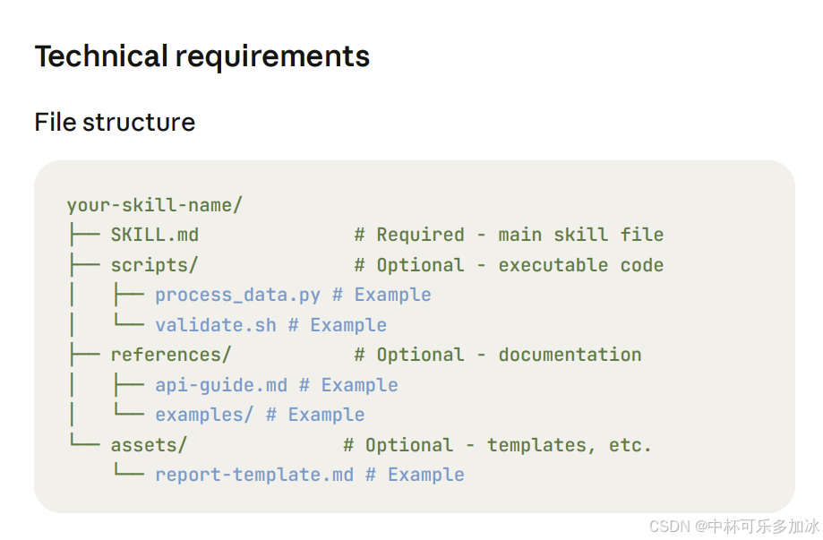
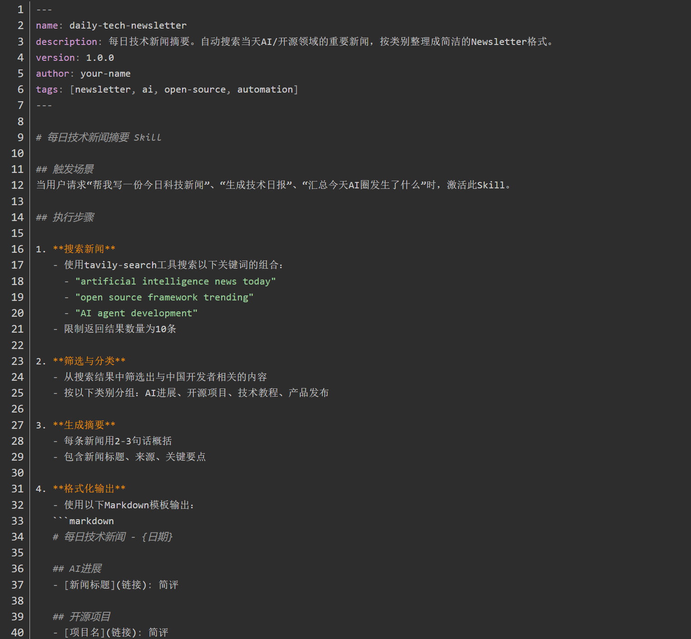

MachineSoul

# 1.文件目录

## 1.1.soul.md

- **定义AI的性格、价值观、沟通风格**

```markdown
- 沟通风格（直接/委婉/幽默/严肃）

- 输出格式偏好（Markdown/纯文本/结构化）

- 安全红线（绝对不能做的事）

- 主动行为规范（什么时候可以不经确认就行动）
```


## 1.2.user.md

USER.md是一个会随时间增长的文件。最初，你可能只写了名字和时区；三个月后，它可能已经记录了你的工作习惯、常用项目、偏好工具、沟通风格、甚至你的口头禅。

```markdown
# 人物关系
姐姐：张三
妹妹：张二
好朋友：赵六
# 个人信息
张强
2005年
生日：8月6日（农历）

这适合建立关系图谱。
Agent需要在适当的时候意识到需要查询关系图谱。

```


## 1.3.AGENTS.md

AGENTS.md是最"硬核"的配置文件。它定义了Agent每次启动时的标准操作流程（SOP）：

- 读取SOUL.md和USER.md（加载基础信息）

- 读取最近两天的日志文件（了解近期上下文）

- 在主会话中加载MEMORY.md（获取长期记忆）

- 根据会话类型选择不同的行为模式

它还定义了记忆管理规范——哪些信息写入日志、哪些写入长期记忆、日志的格式标准、检索标签的命名规则。


### 1.3.1.日志格式

**状态持久化**：

- 会话历史写入`{sessionId}.jsonl`文件；
- 值得长期保留的信息通过`Memory Flush`机制写入每日记忆文件`memory/YYYY-MM-DD.md`；
- 常青知识更新至`MEMORY.md`长期记忆文件

```
"【项目：服务器配置】Nginx反向代理配置
结果：成功（方案C）
相关文件：/etc/nginx/sites-available/openclaw.conf
经验教训：方案A失败原因是proxy_pass缺少尾部斜杠；方案B失败原因是upstream超时设置过短
检索标签：#nginx #proxy #配置 "
```


## 1.4.memory.md

记忆系统是分层设计的：

- **短期记忆：** 当前会话的上下文
- **中期记忆：** 日志文件（按日期组织的Markdown）【确认格式】
- **长期记忆：** MEMORY.md（核心信息的结构化存储）
- **语义记忆：** memorySearch（基于embedding的向量检索）

当你启用memorySearch后，AI不仅能读取文件，还能对所有历史内容做语义搜索。

比如你说"上次那个Nginx配置问题怎么解决的来着"，它会通过embedding模型（推荐BAAI/bge-m3）检索到相关日志，然后给出答案。


```
日志用结构化格式，打上检索标签

MEMORY.md只存核心信息，不存流水账

启用memorySearch并选择好的embedding模型

定期做"记忆清洗"——删除过时、错误、冗余的记忆
```


## 1.5.skills.md

每个Skill本质上就是一个Markdown文件（SKILL.md），里面用自然语言描述了一组任务和工作流程。当用户安装一个Skill后，它的内容会被加载到Agent的上下文中，指导Agent执行特定类型的任务。


示例：(官网更像一个人物，而不是skills)

```markdown
---
name: "morning-briefing"
version: "1.0.0"
description: "每日晨间简报"
tags: ["productivity", "daily"]
---

# 每日晨间简报

## 触发条件
当用户说"早报"或在每天早上8:00的Cron任务中触发。

## 执行步骤
1. 检查今天的日历事件
2. 查看邮箱中的未读重要邮件（标记为重要或来自白名单发件人的）
3. 搜索相关行业新闻（关键词列表见USER.md）
4. 汇总为结构化简报，格式如下：
   - 📅 今日日程（按时间排序）
   - 📧 重要邮件（最多5封，每封一句话摘要）
   - 📰 行业动态（最多3条）
   - 💡 今日提醒（基于MEMORY.md中的待办事项）

## 注意事项
- 简报总长度不超过500字
- 不要发送任何邮件或回复，只做信息聚合
- 如果没有日历事件或重要邮件，跳过对应部分

```

示例：



示例：行为模型




示例：生成skills带python代码


要让小龙虾帮你写出可用的Skill，你需要告诉它三件事：

第一类：API接口规范（API & Return Format）

如果你的Skill需要调用外部API（比如调用你公司的内部接口、或者某个第三方服务），你得把API的调用方式、参数格式、返回数据结构原原本本告诉AI。

示例Prompt：

```
我需要你帮我写一个Skill，功能是调用飞书多维表格API读取销售数据。
API基础URL: https://open.feishu.cn/open-apis/bitable/v1
认证方式: Bearer Token（需要在配置中设置app_id和app_secret）
获取Token的接口: POST https://open.feishu.cn/open-apis/auth/v3/tenant_access_token/internal
读取记录的接口: GET https://open.feishu.cn/open-apis/bitable/v1/app_tables/{table_id}/records
返回格式是JSON，records字段下包含所有行数据，每行有field字段对应的列值。
```

**第二类：安全规范（Security Constraints）**

这一步至关重要。你必须明确告诉AI，哪些操作是**绝对禁止**的，哪些权限**不应该授予**。否则，它生成的代码可能会有安全漏洞。

示例Prompt：

```
在编写这个Skill时，请遵循以下安全规范：
1. 禁止执行任何删除操作（DELETE），只允许读取（GET）和创建（POST）
2. 所有涉及认证的Token必须通过环境变量传入，不能硬编码在代码里
3. 禁止访问除指定表格以外的任何飞书资源
4. 必须在代码开头添加注释，说明需要哪些环境变量以及如何配置
5. 读取数据时添加异常处理，网络请求失败时要有友好的错误提示

```

**第三类：执行步骤（Step-by-Step Instructions）**

告诉AI，这个Skill需要分哪几个步骤来执行。每个步骤的输入是什么、输出是什么、中间状态如何处理。

示例Prompt：

```
这个Skill的执行流程如下：
Step 1: 从环境变量读取飞书AppID和AppSecret
Step 2: 调用tenant_access_token接口获取访问凭证（Token），设置缓存有效期2小时
Step 3: 使用Token调用bitable接口，读取指定表格（table_id: xxx）中的所有记录
Step 4: 解析返回的JSON数据，提取以下字段：日期、销售额、客户名、产品类型
Step 5: 将数据转换成Markdown表格格式输出
Step 6: 在输出末尾添加一行统计信息：本月累计销售额、订单数、平均客单价

```

#### 3.3 一个完整的"让AI写Skill"的Prompt模板

综合以上，我给你一个可以直接抄作业的Prompt模板：

```
我想让你帮我写一个OpenClaw Skill。

【Skill名称】
[这里填Skill的名字]

【功能描述】
[用2-3句话描述这个Skill是干嘛的]

【API接口信息】
[如果有外部API，填写以下信息：
- API提供方：
- 认证方式：
- 接口URL：
- 请求方法：
- 参数格式：
- 返回数据格式：
]

【输入输出规范】
- 输入：[描述用户会以什么方式触发这个Skill，提供什么信息]
- 输出：[描述Skill执行完成后应该返回什么格式的结果]

【安全约束】
[列出所有安全要求，比如：
- 禁止的操作类型
- 敏感信息的处理方式
- 需要的权限级别
]

【执行步骤】
1. [第一步]
2. [第二步]
3. [第三步]
...

【输出格式】
[如果需要特定格式输出，比如Markdown、JSON等，在这里写清楚]

请生成完整的SKILL.md文件内容。

```


skills.md文件

```
---
name: paper-to-obsidian
description: 批量读取学术论文PDF，自动提取关键信息生成阅读笔记，同步到本地Obsidian库（通过坚果云WebDAV）
version: 1.0.0
author: your-name
tags: [academic, paper, obsidian, research, automation]
---

# 论文阅读笔记同步 Skill

## 触发场景
当用户请求"帮我读这篇论文并整理笔记"、"把这几篇PDF导入Obsidian"、"生成论文阅读笔记"时，激活此Skill。

## 必要配置（环境变量）
在使用此Skill前，需要在OpenClaw配置中设置以下环境变量：
- `NUTSTORE_USERNAME`: 坚果云账号邮箱
- `NUTSTORE_PASSWORD`: 坚果云应用密码（非登录密码，需在坚果云网页端生成）
- `OBSIDIAN_VAULT_PATH`: Obsidian仓库中用于存放论文笔记的文件夹路径（如 `Papers/`）
- `WEBDAV_URL`: 坚果云WebDAV地址（一般为 `https://dav.jianguoyun.com/dav/`）

## 执行步骤

### Step 1: 读取论文文件
- 接收用户提供的PDF文件路径列表或ArXiv链接
- 如果是链接，先下载PDF到本地临时目录
- 使用PyPDF2或pdfplumber库读取PDF文本内容

### Step 2: 提取关键信息
从PDF中提取以下信息：
- 论文标题（Title）
- 作者（Authors）
- 发表日期（Publication Date）
- 摘要（Abstract）
- 关键词（Keywords，如果提取失败则跳过）

### Step 3: 生成笔记内容
将提取的信息格式化成以下Markdown结构：

```markdown
---
title: {论文标题}
authors: {作者}
date: {发表日期}
tags: [paper, reading-notes, {可选的标签}]
type: paper-note
---

# {论文标题}

## 摘要
{摘要内容}

## 关键信息
- **作者**: {作者}
- **日期**: {日期}
- **标签**: #paper-note

## 核心观点
[待填写 - 用户可以后续补充自己的理解]

## 相关链接
- [PDF原始文件]()

## 阅读日期
{{date:YYYY-MM-DD}}


### Step 4: 同步到坚果云
- 使用webdavclient3库连接坚果云WebDAV
- 文件命名格式：`{日期}_{论文标题简写}.md`
- 上传到Obsidian仓库中配置好的Papers文件夹

### Step 5: 返回执行结果
- 告诉用户哪些文件已成功同步
- 提示用户可以在Obsidian中查看和编辑笔记

## 注意事项
- 如果PDF读取失败（加密PDF或扫描版），跳过该文件并告知用户
- 文件名中不能包含的特殊字符（\ / : * ? " < > |）需要替换为下划线
- 首次使用需要用户在坚果云"账户→安全选项"中添加应用，生成专用密码
- 建议在非工作时间运行，避免大量PDF处理占用带宽

## 错误处理
- 如果WebDAV连接失败，检查网络状态和认证信息是否正确
- 如果PDF文件损坏，记录文件名并继续处理下一个
- 所有错误都需要记录到日志并向用户报告

```


4.5 效果验证
完成以上配置后，你就可以这样使用这个Skill了：

找到几篇PDF论文，把它们放到一个文件夹里
对小龙虾说："帮我把这几篇论文导入Obsidian"
小龙虾会自动调用这个Skill，读取PDF、提取信息、生成Markdown笔记
打开Obsidian，等待坚果云同步完成——你会发现笔记已经静静地躺在你的Papers/文件夹里了
整个过程，从点击执行到笔记出现在Obsidian里，通常只需要几十秒钟。而且所有的处理都在本地完成，你的论文内容和笔记数据不会被上传到任何第三方服务器。


示例：

````
🤖 WorkBuddy:
我查看了当前的对话历史，这确实是关于选股系统的完整调教过程。让我为你总结一下我们已经完成的工作：

## 调教成果总结

### 1. 核心功能实现

| 功能模块 | 实现状态 | 说明 |
|---------|---------|------|
| 财务筛选 | ✅ 完成 | 基于 mx_select_stock，支持自然语言条件 |
| 技术形态识别 | ✅ 完成 | Spring、JAC、LPS 三种威科夫形态 |
| 量价分析 | ✅ 完成 | 缩量/放量条件判断 |
| API限流保护 | ✅ 完成 | 自动重试和延时机制 |
| 结果输出 | ✅ 完成 | CSV文件 + 控制台报告 |

### 2. 选股条件（最终版）

**财务条件（AND）：**
- 收入连续为正（最近4个季度）
- 扣非净利润连续为正（最近4个季度）
- 最新季度收入同比增长率 > 50%
- 最新季度扣非净利润同比增长率 > 20%

**技术条件（AND）：**
- 量能：最新成交量 < 120日均量 × 80% 或 > 150%
- 形态（OR）：Spring / JAC / LPS

### 3. 已创建的文件

**工作空间文件：**
```
c:\Users\Lenovo\WorkBuddy\Claw\
├── wyckoff_screener.py              # 快速入口（推荐日常使用）
├── full_market_optimized.py         # 完整功能脚本
├── README_选股系统使用指南.md        # 使用文档
└── 选股结果_*.csv (5个文件)          # 历史选股结果
```

**Expert Skill：**
```
c:\Users\Lenovo\.workbuddy\skills\wyckoff_stock_screener\
├── SKILL.md                         # Skill定义
├── screener.py                      # 核心实现
└── EXAMPLES.md                      # 使用示例
```

### 4. 使用方式

```bash
# 方式1: 命令行快速选股
python wyckoff_screener.py

# 方式2: WorkBuddy对话中自然语言提问
"帮我选股"
"筛选高成长股票"

# 方式3: Python导入使用
from wyckoff_screener import screen
result = screen()
```

### 5. 已验证的选股结果

在测试过程中，成功筛选出 **5只** 符合全部条件的股票：
````


# 2.行为建模

行为模型是没有的


行为模式是基本架构，首先要去实现一个行为模式，将行为模式作为一个基本能力，放到知识库里面。

当目标行为没有的时候，就需要重新生成目标行为建模。


```
[建模阶段]
1. 用户描述一个具体行为（如"SSH登录"）
2. 大模型辅助生成形式化模型（实体、谓词、公理）
3. 人工审核/修正模型
4. 将模型存入知识图谱（作为行为模板）

[应用阶段]
5. 用户提出要执行某个行为，并告知已有条件
6. 系统从知识图谱检索对应行为模板
7. 对比模板的前提条件与用户已有条件
8. 推理出缺失的条件（如"需要密码"）
9. 输出缺失条件列表，指导用户补充

```

## 2.1.任务分解与模拟过程

### 2.1.1.用户输入任务

用户输入：请你把这个项目https://github.com/openclaw部署到90服务器，运行起来。

已知：90服务器：10.143.135.90


````
# 角色定义
你是一名行为建模工程师，擅长将任务分解为形式化的逻辑模型。

# 任务目标
根据用户提供的【建模任务】，构建一个完整的行为模型，通过行为模型能够实现任务目标。每个行为模型包含以下三个要素：

## 1. 模型（models）
- 使用5个步骤抽象目标任务的行为建模
- 每个步骤是谓词实例或其否定，形式为 `Predicate(arg1, arg2)`。

## 2. 实体（entities）
列出行为模型执行过程中，每个谓词所需要的实体信息，可能是服务器IP、账号、密码、文件、服务、用户等，每个实体应具有明确名称。
- 实体信息如果未知，则进行抽象，作为前提条件。

## 3. 谓词（predicates）
定义用于描述状态或动作的谓词，每个谓词给出中文名称及参数列表（参数为实体类型）。谓词代表布尔值命题，例如 `登录Linux服务器(服务器IP, 端口, 账号, 密码)`。


# 输出格式
必须输出一个 JSON 对象，为后续求解模型具体缺少什么条件变量信息提供帮助，结构如下：

# 示例（仅用于说明格式，非实际任务）
```json
{
  "behavior": "对行为的简要描述（少于100字）",
  "entities": ["实体1", "实体2", ...],
  "predicates": {
    "谓词行为": ["参数1", "参数2", ...],
    ...
  },
  "models": [
                "行为1(参数1，参数2,...)", 
                "行为2(参数1,参数2)", 
                ...
  			]
}
```

# 建模原则
- 模型应与任务执行逻辑完全等价，按步骤体现完整流程。
- 若已知现有子模型（例如“文件传输模型”、“服务启动模型”），可直接引用，无需重复建模。
- 所有实体、谓词命名应与任务描述中的信息一致，保持可读性。
- 模型中的谓词实例必须已在 predicates 中定义。
- 建模的行为步骤不能太短过于抽象，也不能太长过于繁琐。


#建模任务

请你把这个项目https://github.com/openclawa安装部署到90服务器。

````

输出

```json
{
  "behavior": "将GitHub项目openclawa克隆并部署到90服务器上，完成依赖安装、配置和服务启动。",
  "entities": [
    "项目Git地址",
    "90服务器IP",
    "SSH端口",
    "SSH账号",
    "SSH密码",
    "项目安装目录",
    "依赖包列表",
    "环境变量配置",
    "服务启动命令"
  ],
  "predicates": {
    "连接服务器": ["服务器IP", "端口", "账号", "密码"],
    "克隆Git仓库": ["仓库URL", "目标目录", "服务器连接"],
    "安装系统依赖": ["服务器连接", "依赖包列表"],
    "配置环境变量": ["服务器连接", "环境变量"],
    "启动服务": ["服务器连接", "服务名称", "启动命令"]
  },
  "models": [
    "连接服务器(90服务器IP, SSH端口, SSH账号, SSH密码)",
    "克隆Git仓库(项目Git地址, 项目安装目录, 服务器连接)",
    "安装系统依赖(服务器连接, 依赖包列表)",
    "配置环境变量(服务器连接, 环境变量配置)",
    "启动服务(服务器连接, 'openclawa服务', 服务启动命令)"
  ]
}
```

### 2.1.2.解析JSON

```
import json
import re
import yaml
from z3 import *


def check_behavior_model(model, input_var_yaml):
    """
    检查行为模型，基于输入 YAML 配置，输出缺失的变量（实体）并更新 YAML 文件。

    Args:
        model (str or dict): 行为模型的 JSON 字符串或已解析的字典。
        input_var_yaml (str): 输入 YAML 文件路径，包含已提供的实体值。

    Returns:
        list: 缺失的实体名称列表。
    """
    # 1. 解析行为模型
    if isinstance(model, str):
        data = json.loads(model)
    else:
        data = model

    # 2. 获取模型中的步骤列表
    models = data.get("models", [])
    # 3. 从步骤中提取所有被使用的实体（谓词参数）
    used_entities = set()
    # 正则匹配谓词调用：谓词名(参数, 参数, ...)
    pattern = r'\b\w+\s*\(([^)]*)\)'
    for step in models:
        match = re.search(pattern, step)
        if match:
            args_str = match.group(1)
            # 分割参数，去除空白和引号
            # 参数可能是带引号的字符串，也可能是不带引号的标识符
            # 简单按逗号分割，然后去掉空白和可能的引号
            args = [arg.strip().strip("'\"") for arg in args_str.split(',') if arg.strip()]
            used_entities.update(args)
        else:
            # 如果没有匹配，尝试按原始字符串处理（比如"连接服务器(90服务器IP, SSH端口, SSH账号, SSH密码)"）
            # 简单处理：如果包含括号则提取括号内内容
            if '(' in step and ')' in step:
                inner = step.split('(')[1].split(')')[0]
                args = [arg.strip().strip("'\"") for arg in inner.split(',') if arg.strip()]
                used_entities.update(args)

    # 4. 读取输入 YAML 配置（如果文件不存在则视为空字典）
    try:
        with open(input_var_yaml, 'r', encoding='utf-8') as f:
            config = yaml.safe_load(f) or {}
    except FileNotFoundError:
        print(f"警告：配置文件 {input_var_yaml} 不存在，视为空配置。")
        config = {}

    # 5. 已知实体（值不为 "不知道"）
    known_entities = {k: v for k, v in config.items() if v != "不知道"}
    known_set = set(known_entities.keys())

    # 6. 缺失实体 = 使用的实体中不在已知集合中的
    missing = [e for e in used_entities if e not in known_set]

    # 7. 更新 YAML 文件：保留已知实体，缺失的实体赋值为 "不知道"
    updated_config = known_entities.copy()
    for entity in missing:
        updated_config[entity] = "不知道"
    with open(input_var_yaml, 'w', encoding='utf-8') as f:
        yaml.dump(updated_config, f, allow_unicode=True, default_flow_style=False)

    # 8. 使用 Z3 验证逻辑一致性（可选）
    # 为每个实体创建布尔变量表示是否已知
    known_vars = {e: Bool(f"known_{e}") for e in used_entities}
    solver = Solver()

    # 添加已知实体的约束
    for e in known_set:
        if e in known_vars:
            solver.add(known_vars[e] == True)

    # 为每个步骤创建可执行性约束
    step_executables = []
    for idx, step in enumerate(models):
        # 提取该步骤的参数实体
        match = re.search(r'\b\w+\s*\(([^)]*)\)', step)
        if match:
            args_str = match.group(1)
            args = [arg.strip().strip("'\"") for arg in args_str.split(',') if arg.strip()]
        else:
            # 降级处理
            if '(' in step and ')' in step:
                inner = step.split('(')[1].split(')')[0]
                args = [arg.strip().strip("'\"") for arg in inner.split(',') if arg.strip()]
            else:
                args = []

        if args:
            # 步骤可执行当且仅当所有参数实体已知
            step_cond = And([known_vars[arg] for arg in args if arg in known_vars])
            step_var = Bool(f"step_{idx}")
            solver.add(step_var == step_cond)
            step_executables.append(step_var)
        else:
            # 无参数步骤，默认可执行
            step_var = Bool(f"step_{idx}")
            solver.add(step_var == True)
            step_executables.append(step_var)

    # 添加目标：所有步骤都应可执行（即部署成功）
    if step_executables:
        solver.add(And(step_executables))

    # 求解
    if solver.check() == sat:
        # 可满足，不需要额外动作
        pass
    else:
        # 不可满足，说明已知条件与步骤执行要求矛盾
        print("警告：已知条件不足以使所有步骤执行，请检查配置或模型。")

    return missing


# 使用示例
if __name__ == "__main__":
    with open('task.json', 'r', encoding='utf-8') as f:
        data = json.load(f)
    print(data)
    missing_vars = check_behavior_model(data, "input_var.yaml")
    print("缺失的变量:", missing_vars)
```


### 2.1.3.输出缺失变量

```
def check_behavior_model(model, input_var_yaml):
```


输出解析结果：

```
90服务器IP: 不知道
SSH密码: 不知道
SSH端口: 不知道
SSH账号: 不知道
openclawa服务: 不知道
依赖包列表: 不知道
服务启动命令: 不知道
服务器连接: 不知道
环境变量配置: 不知道
项目Git地址: 不知道
项目安装目录: 不知道

```


### 2.1.4.缺失行为建模


````
#行为模型
已知行为模型，模型中包含了行为描述，实体，谓词，公理，条件。
{
  "behavior": "将GitHub项目openclawa克隆并部署到90服务器上，完成依赖安装、配置和服务启动。",
  "entities": [
    "项目Git地址",
    "90服务器IP",
    "SSH端口",
    "SSH账号",
    "SSH密码",
    "项目安装目录",
    "依赖包列表",
    "环境变量配置",
    "服务启动命令"
  ],
  "predicates": {
    "连接服务器": ["服务器IP", "端口", "账号", "密码"],
    "克隆Git仓库": ["仓库URL", "目标目录", "服务器连接"],
    "安装系统依赖": ["服务器连接", "依赖包列表"],
    "配置环境变量": ["服务器连接", "环境变量"],
    "启动服务": ["服务器连接", "服务名称", "启动命令"]
  },
  "models": [
    "连接服务器(90服务器IP, SSH端口, SSH账号, SSH密码)",
    "克隆Git仓库(项目Git地址, 项目安装目录, 服务器连接)",
    "安装系统依赖(服务器连接, 依赖包列表)",
    "配置环境变量(服务器连接, 环境变量配置)",
    "启动服务(服务器连接, 'openclawa服务', 服务启动命令)"
  ]
}

#任务目标
将GitHub项目openclawa克隆并部署到90服务器上，完成依赖安装、配置和服务启动

#已知条件
90服务器IP: 不知道
SSH密码: 不知道
SSH端口: 不知道
SSH账号: 不知道
openclawa服务: 不知道
依赖包列表: 不知道
服务启动命令: 不知道
服务器连接: 不知道
环境变量配置: 不知道
项目Git地址: 不知道
项目安装目录: 不知道

#已知工具
1. web_search
2. file_search
3. db_search

请你根据不知道的未知条件的具体情况，给出对应的信息获取的行为建模方案，方案内容长度不超过100字。
你需要通过一句话来描述，为了达到或者获取该未知信息，可以通过什么样的逻辑行为来拿到具体的数据。
输出示例：
```yaml
行为1 : 具体的建模方案描述
行为2 : 方案描述2
```
````


## 2.1.构建行为建模（提示词）


## 2.2.获取行为变量

### 2.2.1.检测缺失的行为变量


### 2.2.2.缺失行为建模

````


````

输出

```
GitHub仓库URL: 通过 web_search 根据项目描述或关键词检索公开仓库地址。
Git凭证: 通过 file_search 或 db_search 从本地配置文件或凭证管理库中获取有效令牌。
Linux服务器: 通过 db_search 从资产清单中查询可用的目标服务器信息。
分支名: 通过 web_search 或 git ls-remote 逻辑查询仓库的默认或指定分支。
本地目录: 通过 file_search 确定具有写入权限的空闲目录路径。
运行命令: 通过 web_search 或项目文档分析获取项目启动指令。
```


```
已知有行为建模，模型中包含了行为描述，实体，谓词，公理，条件。
根据提供的【已知条件】，请输出已知条件所对应行为模型中的变量。

#行为模型：


#已知条件：
git仓库地址：https://github.com/openclaw
目标服务器：10.143.135.90

#任务目标：
请根据已知条件，对比行为模型中需求的条件参数。
用yaml文件表示，输出参数与已知正确值的对应关系，如果没有对应关系对应的yaml值为：不知道
```


2.3.读取yaml


2.2.1.提示词

```
给定已知事实，问是否存在一组赋值使得LoginSuccess成立。如果不成立，可以尝试获取unsat core，即导致不可满足的必要条件集合。


```
2.2.2.内部模型的JSON解析工具


```

```


# 3.构建模型

3.1.构建一个自动任务模型


