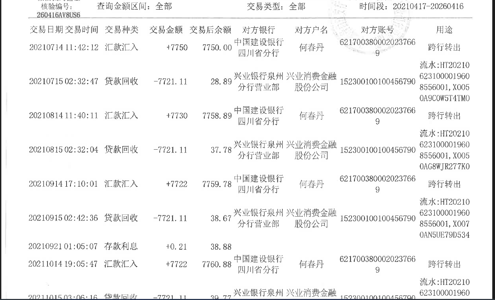

| 企业名称                 | 岗位名称                | 职位职责要求                                                 | 需求人数 |
| ------------------------ | ----------------------- | ------------------------------------------------------------ | -------- |
| 成都天开智能科技有限公司 | 大模型应用开发(RAG方向) | 技能要求： 1.Python 基础扎实，熟悉异步编程、常用数据结构和装饰器，有良好的代码规范意识； 2.了解 GPT、ChatGLM、Qwen 等模型 API 调用方式； 3.了解 RAG 原理（如向量检索、重排序、上下文注入等）； 4.对大模型有基本认知，了解 GPT、ChatGLM、Qwen 等模型 API 调用方式； 5.熟悉 LangChain 或 LlamaIndex 等大模型应用框架，能基于其构建简单的链或检索器； 6.了解 SSE、WebSocket 或 HTTP 长连接，能配合后端实现流式数据推送； 7.对人工智能和大模型感兴趣，能够编写设计文档，产品文档，能清晰记录开发过程、输出技术文档。 | 3        |

